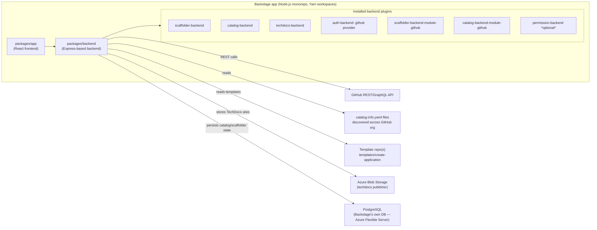
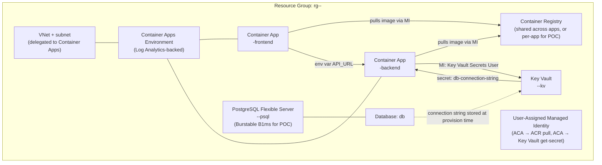

# Architecture

## 1. End-to-end architecture diagram

```mermaid
flowchart TB
    Dev["Developer<br/>(browser)"]

    subgraph Backstage["Backstage (Azure Container Apps)"]
        UI["Backstage App<br/>(React frontend)"]
        Scaffolder["Scaffolder engine"]
        Catalog["Software Catalog"]
        TechDocs["TechDocs"]
        AuthGH["GitHub Auth"]
    end

    subgraph GitHub["GitHub"]
        RepoFE["<app>-frontend repo"]
        RepoBE["<app>-backend repo"]
        RepoInfra["<app>-infra repo"]
        GHA["GitHub Actions"]
    end

    subgraph Azure["Azure Subscription (DEV)"]
        RG["Resource Group<br/>rg-<app>-dev"]
        ACR["Azure Container Registry"]
        ACAEnv["Container Apps Environment"]
        ACAFe["Container App: frontend"]
        ACABe["Container App: backend"]
        PG["Azure DB for PostgreSQL<br/>Flexible Server"]
        KV["Azure Key Vault"]
        TFState["Storage Account<br/>(Terraform remote state)"]
    end

    Dev -->|1. Create Application form| UI
    UI --> Scaffolder
    Scaffolder -->|2. create repos from skeleton| RepoFE
    Scaffolder --> RepoBE
    Scaffolder --> RepoInfra
    Scaffolder -->|3. register| Catalog
    Catalog --> TechDocs
    UI <--> AuthGH
    AuthGH <-.-> GitHub

    RepoInfra -->|push to main| GHA
    RepoFE -->|push to main| GHA
    RepoBE -->|push to main| GHA

    GHA -->|terraform apply| RG
    RG --- ACR & ACAEnv & PG & KV & TFState
    ACAEnv --- ACAFe & ACABe

    GHA -->|docker build & push| ACR
    GHA -->|az containerapp update image| ACAFe
    GHA -->|az containerapp update image| ACABe
    ACR -.->|pull image| ACAFe
    ACR -.->|pull image| ACABe

    ACABe -->|connection string from| KV
    ACABe -->|reads/writes| PG
    KV -.->|OIDC federated identity, no static secrets| GHA

    ACAFe -.->|calls API| ACABe

    Catalog -.->|links: repo, deploy URL, API URL, DB info| Dev
```



**Key design choice — GitOps, not live provisioning from the Backstage backend.** The Scaffolder's
job stops at "create repos + push code + register in Catalog." Actual Azure provisioning and
deployment happen via GitHub Actions triggered by the commit the Scaffolder makes to `main`. This
keeps the Backstage backend stateless with respect to cloud credentials (only GitHub App/PAT
creds are needed there), pushes all cloud credentials into GitHub OIDC, and gives you an audit
trail (PRs/Actions runs) for every environment change — which is also how you'd want it to work in
production, so the POC and the production pattern are the same shape.

## 2. Backstage architecture



Backstage itself runs as a single Container App (frontend+backend built together, standard
`yarn build:backend` Docker image) inside the same Container Apps Environment used for
generated apps, backed by its own small Postgres Flexible Server instance and a Blob Storage
container for TechDocs. This is the standard Backstage deployment shape — no Kubernetes required.

## 3. Required plugins

| Plugin | Package | Purpose |
|---|---|---|
| Scaffolder (frontend+backend) | `@backstage/plugin-scaffolder`, `@backstage/plugin-scaffolder-backend` | Runs `template.yaml`, exposes "Create" UI |
| GitHub actions module for Scaffolder | `@backstage/plugin-scaffolder-backend-module-github` | `publish:github` action — creates repos |
| Catalog (frontend+backend) | `@backstage/plugin-catalog`, `@backstage/plugin-catalog-backend` | Entity model, catalog UI, relations graph |
| Catalog GitHub discovery | `@backstage/plugin-catalog-backend-module-github` | Auto-discovers `catalog-info.yaml` across the GitHub org |
| TechDocs (frontend+backend) | `@backstage/plugin-techdocs`, `@backstage/plugin-techdocs-backend` | Renders `docs/` (mkdocs) per component |
| GitHub Auth | `@backstage/plugin-auth-backend-module-github-provider` | Sign-in with GitHub |
| GitHub Actions plugin (view CI runs) | `@backstage-community/plugin-github-actions` | Shows workflow runs on the entity page |
| Kubernetes plugin | *not used* | Explicitly out of scope — Container Apps instead of AKS |
| Azure DevOps plugin | *not used* | Source control is GitHub only in this POC |
| Cost/insights (`cost-insights`) | *roadmap* | Nice-to-have, not MVP |
| Permission framework | `@backstage/plugin-permission-backend` | *roadmap* — MVP uses default allow-all |

## 4. Azure resource architecture (per application, per environment)



Notes for the POC:
- **One ACR per environment** (or shared across all apps — cheaper, still fine for a POC) rather
  than per-application, to avoid registry sprawl; images are namespaced `<app>-frontend:<sha>` /
  `<app>-backend:<sha>`.
- **Managed identity, not secrets, for ACR pull and Key Vault access** — Container Apps supports
  user-assigned managed identity for both, so the only secret ever handled by a human is the
  Postgres admin password, which Terraform generates randomly and writes straight to Key Vault
  (never printed to Actions logs).
- **Postgres Flexible Server firewall**: POC allows Azure services + the Container Apps subnet via
  a delegated VNet rule; production roadmap moves to VNet-integrated private access only.
- **DEV environment sizing**: `Standard_B1ms` (Postgres), `0.5 vCPU / 1Gi` Container Apps, min
  replicas 0 (scale-to-zero) to keep POC cost near-zero when idle.

## 5. Repository structure produced per application

Each "Create Application" run produces **three GitHub repositories**:

```
<app>-frontend/
├── catalog-info.yaml
├── Dockerfile
├── package.json
├── tsconfig.json
├── src/
│   ├── App.tsx
│   └── index.tsx
├── docs/                     # TechDocs
│   └── index.md
├── mkdocs.yml
└── .github/workflows/ci-cd.yaml

<app>-backend/
├── catalog-info.yaml
├── Dockerfile
├── package.json
├── tsconfig.json
├── src/
│   ├── index.ts
│   └── routes/health.ts
├── docs/
│   └── index.md
├── mkdocs.yml
└── .github/workflows/ci-cd.yaml

<app>-infra/
├── catalog-info.yaml
├── main.tf                   # composes terraform-modules/*
├── variables.tf
├── outputs.tf
├── backend.tf                 # remote state config
├── terraform.tfvars
├── docs/
│   └── index.md
└── .github/workflows/terraform.yaml
```

> **Note on the skeleton files:** anything under `templates/create-application/skeleton/` containing
> `${{values.x}}` is a Nunjucks placeholder the Scaffolder's `fetch:template` action renders into a
> literal value *before* committing to the new repo — this applies to `.tf`, `.json`, `.tsx`, and
> `.yaml` files alike. The raw, unrendered skeleton is therefore not valid Terraform/JSON/TSX on its
> own (e.g. `terraform fmt`/`validate` will reject it as-is) — that's expected; only the rendered
> output committed to `<app>-frontend`/`<app>-backend`/`<app>-infra` needs to be valid.

Plus a fourth logical grouping entity — the `System` — that lives as a `catalog-info.yaml`
committed into `<app>-infra` (or a central catalog repo) tying all three together, so the Catalog
graph renders:

```
System: <app>
 ├── Component: <app>-frontend
 ├── Component: <app>-backend
 ├── Resource: <app>-database
 └── Resource: <app>-infra
```

See [templates/create-application/](../templates/create-application/) for the literal skeleton
files and [templates/create-application/template.yaml](../templates/create-application/template.yaml)
for the Scaffolder actions that assemble and push them.
